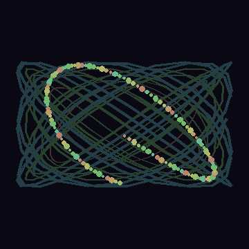
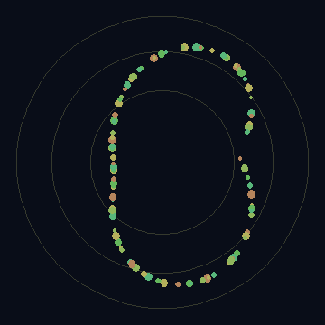
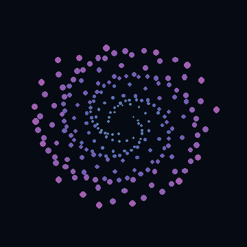

# Digital Harmony Studies

`digital-harmony-studies` is a public-facing creative-coding repository for John Whitney-inspired harmonic motion graphics. It is designed as a reproducible browser project first, not as a loose sketch dump: the repo separates historically grounded studies from modern extensions, renders deterministic loops in the browser, and ships with explicit public-release guardrails.
<!-- 

<p align="center">
  
</p>

<p align="center"><em><code>arabesque-counterpoint</code> - Whitney-inspired study used as the primary public preview loop.</em></p> -->

## Repository objective

The minimum viable public repo is:

- a fast static site that runs smoothly on GitHub Pages;
- a shared TypeScript animation core for harmonic point and curve systems;
- a small sketch catalog with clear provenance labels;
- browser-native still and loop export;
- tests that check loop closure, finite geometry, and public-safe text.

The expanded version is a research-grade Whitney study archive with tighter page-level citations, more sketches, renderer variants, and artifact generation in CI.

## Scope and source boundaries

- `Historically grounded study` means the sketch is anchored to documented Whitney concepts such as harmonic motion, cyclic point systems, optical accumulation, or film-level descriptions. It is not a claim of exact machinery reconstruction.
- `Whitney-inspired study` means the sketch stays inside Whitney's visual and mathematical language but is a modern interpretation.
- `Modern extension` means the sketch intentionally uses contemporary techniques or heuristics beyond the historical source base.

Read [docs/source-boundaries.md](docs/source-boundaries.md) before describing any sketch publicly.

## Stack decision

This repo uses raw Canvas 2D and TypeScript rather than p5.js as the core runtime.

- Canvas 2D is the production path because it is smaller, easier to reason about, and gives direct control over deterministic rendering and export.
- Vite is the delivery/build tool.
- Vitest is the geometry and catalog test harness.
- FFmpeg is optional and only used after browser-native `.webm` export when a `.gif` or `.mp4` derivative is needed.

Packages evaluated but not chosen as the core runtime:

- `p5.js`: historically aligned and accessible, but not needed for the shared production runtime here.
- `three.js`: valuable for future 3D extensions, not justified for the first public release.
- `Hydra`, `openFrameworks`, `TouchDesigner`, `Manim`: adjacent or future-facing, but not the public baseline.

## Sketch catalog

| Sketch | Classification | Main idea | Validation focus |
| --- | --- | --- | --- |
| `catalog-radial-canon` | Historically grounded study | Phase-offset radial point orbits with trail accumulation | Loop closure, bounds, readable layering |
| `permutations-lattice` | Historically grounded study | Lissajous-like dot permutations across a structured matrix | Loop closure, finite lattice drift |
| `matrix-polygon-study` | Historically grounded study | Triangle, square, and hexagon families under rational rotation | Vertex closure, stable path counts |
| `arabesque-counterpoint` | Whitney-inspired study | Long-trail harmonic ribbons with color sequencing | Trail readability, browser smoothness |
| `phase-bloom` | Modern extension | Golden-angle phase distribution with additive blooms | Determinism, controlled density |

See [docs/sketch-catalog.md](docs/sketch-catalog.md) for the full public catalog format.

## Preview examples

| Category | Sketch | Preview | What it demonstrates |
| --- | --- | --- | --- |
| Historically grounded study | `catalog-radial-canon` |  | Harmonic radial motion, phase offsets, and optical accumulation. |
| Whitney-inspired study | `arabesque-counterpoint` |  | Long-trail ribbons and color counterpoint for the repo hero example. |
| Modern extension | `phase-bloom` |  | A contemporary contrast piece with denser harmonic placement. |

The committed GIFs are documentation previews generated from the corresponding sketch formulas. They are intentionally small and loop-clean for GitHub rendering, not full browser-capture artifacts.

## Local development

```bash
npm install
npm run dev
```

Production build:

```bash
npm run build
```

Verification:

```bash
npm run check
```

## Export workflow

The site supports two first-class public exports without extra build tools:

- `Download PNG` saves the current frame.
- `Record WebM Loop` captures a single loop at the sketch's configured FPS.

Then, if FFmpeg is installed locally, convert derivatives:

```bash
ffmpeg -i exports/arabesque-counterpoint.webm -c:v libx264 -pix_fmt yuv420p exports/arabesque-counterpoint.mp4
ffmpeg -i exports/arabesque-counterpoint.webm -vf "fps=24,scale=960:-1:flags=lanczos" exports/arabesque-counterpoint.gif
```

Details: [docs/export-pipeline.md](docs/export-pipeline.md)

## Public deployment

The repo includes a GitHub Pages Actions workflow for project-site deployment. Vite builds with a relative base, so the output works under `https://<owner>.github.io/<repo>/` without route rewriting.

Repository setting required once:

- GitHub -> `Settings` -> `Pages` -> `Build and deployment` -> `Source: GitHub Actions`

Workflow files:

- [ci.yml](.github/workflows/ci.yml)
- [deploy-pages.yml](.github/workflows/deploy-pages.yml)

## Licensing and attribution

- Code in this repository: MIT. See [LICENSE](LICENSE).
- Historical source material remains separately attributed and is not bundled as copyrighted film frames.
- Do not imply exact reconstruction of Whitney's physical machinery without stronger archival evidence.

## Release checklist

- `npm run check`
- verify each sketch label is still accurate
- confirm no local absolute paths or scratch notes leaked into docs
- test the built site in at least one Chromium browser and one WebKit/Firefox-family browser
- keep exported media intentionally curated; do not commit large scratch captures
