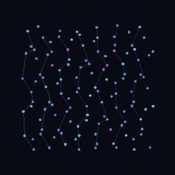
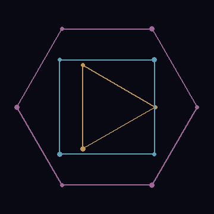

# Sketch Catalog

## Catalog structure

Each sketch entry should keep the same public fields:

- `id`
- `title`
- `classification`
- `source basis`
- `mathematical idea`
- `implementation note`
- `recommended outputs`
- `validation checks`

## Current release catalog

The preview GIFs in this page are deterministic documentation renders generated by `py -3 scripts/render_gifs.py`. They are derived from the corresponding sketch formulas and tuned for GitHub readability.

### `catalog-radial-canon`

  

- Classification: Historically grounded study
- Source basis: phase-offset radial point systems and optical accumulation associated with Whitney's early harmonic motion language
- Mathematical idea: rational angular frequencies, sinusoidal radius modulation, layered guide rings
- Output focus: looping browser preview, still frame, short loop video

### `permutations-lattice`

  

- Classification: Historically grounded study
- Source basis: matrix-like dot motion and permutation structure
- Mathematical idea: lattice anchors with phase-shifted local harmonic displacement
- Output focus: browser loop, gallery still, technical note on loop closure

### `matrix-polygon-study`

  

- Classification: Historically grounded study
- Source basis: geometric families associated with documented descriptions of `Matrix III`
- Mathematical idea: rationally rotating triangle, square, and hexagon paths
- Output focus: vector-like still, looped web animation

### `arabesque-counterpoint`

  

- Classification: Whitney-inspired study
- Source basis: flowing harmonic ribbons and color counterpoint inspired by later Whitney work
- Mathematical idea: nested Lissajous-derived curves and phase-driven point canons
- Output focus: hero animation, WebM loop

### `phase-bloom`

  

- Classification: Modern extension
- Source basis: none claimed beyond shared harmonic vocabulary
- Mathematical idea: golden-angle phase placement and additive bloom
- Output focus: modern contrast piece inside the gallery
